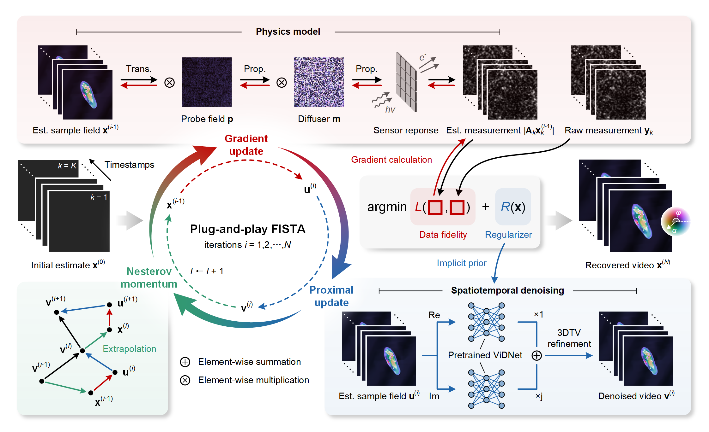

<h1> Video Plug-and-Play Optimization for Time-Resolved Computational Microscopy </h1>

**[Yunhui Gao](https://github.com/Yunhui-Gao)** (gyh21@mails.tsinghua.edu.cn) and **[Liangcai Cao](https://scholar.google.com/citations?user=FYYb_-wAAAAJ&hl=en)** (clc@tsinghua.edu.cn)

:school: ***[HoloLab](http://www.holoddd.com/)**, Tsinghua University*

*Manuscript submitted. The full version of the code will be released upon publication.*

Computational microscopy combines advances in optical hardware and signal processing to push the boundaries of imaging resolution and functionality. However, acquiring extended information often comes at the expense of temporal resolution. Here, we present a model-based deep learning framework for **time-resolved imaging in multi-shot computational microscopy**. Building upon the plug-and-play (PnP) optimization theory, our approach integrates the low-level spatiotemporal priors learned from large-scale video datasets with the physical model of an optimized measurement scheme, enabling accurate, time-resolved reconstruction of dynamic scenes. Using lensless ptychographic microscopy as an example, we experimentally demonstrate high-speed holographic imaging of an order of magnitude faster sample dynamics without compromising quality. Additionally, we show that the proposed framework enables high-throughput, label-free imaging of various biological activities of freely moving organisms, such as paramecia and rotifers, with a sensor-limited space-bandwidth-time product of 227 megapixels per second. The presented approach provides a promising solution to time-resolved computational microscopy across a broad range of imaging modalities.

## Selective Results

##### 1. Holographic imaging of freely moving organisms

We experimentally demonstrate time-resolved holographic imaging of freely moving organisms based on coded ptychography. The following results show the holographic videos of paramecium and rotifer samples, visualized in the HSL color space.

 &nbsp;

##### 2. Quantitative comparison with existing PnP priors

The following figure shows the experimental reconstruction of a xylophyta dicotyledon stem section translating at a speed of 5 pixels per frame. Compared with other popular PnP priors including [3DTV](https://github.com/THUHoloLab/STRIVER), [DRUNet](https://github.com/cszn/DPIR), and [FastDVDnet](https://github.com/m-tassano/fastdvdnet), ViDNet maintains the finest spatial textures and the best temporal consistency.

The following table summarizes the average amplitude PSNR (dB) under varying sample translation speeds. ViDNet yields competitive performance even when the sample is moving **almost an order of magnitude faster**! :wink:

| Speed (pixel/frame) | 3DTV              | DRUNet + 3DTV | FastDVDnet + 3DTV | ViDNet + 3DTV     |
| :----:              | :----:            | :----:        | :----:            | :----:            |
| 0                   | **21.17 (+0.30)** | 17.74         | 18.26             | 20.87             |
| 1                   | 15.68             | 15.58         | 16.87             | **19.83 (+2.96)** |
| 2                   | 14.56             | 14.58         | 16.01             | **19.33 (+3.32)** |
| 3                   | 14.09             | 14.27         | 15.59             | **19.18 (+3.59)** |
| 4                   | 13.80             | 14.07         | 15.05             | **18.77 (+3.72)** |
| 5                   | 13.61             | 13.93         | 14.49             | **18.44 (+3.95)** |
| 6                   | 13.47             | 13.84         | 14.00             | **17.96 (+3.96)** |
| 7                   | 13.37             | 13.77         | 13.64             | **17.40 (+3.63)** |
| 8                   | 13.30             | 13.65         | 13.37             | **17.00 (+3.35)** |
| 9                   | 13.24             | 13.63         | 13.18             | **16.55 (+2.92)** |

